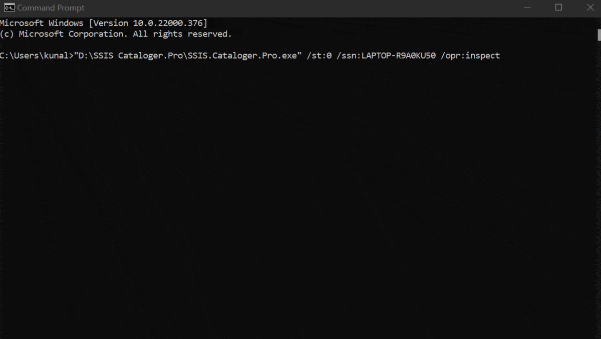

With the SSIS Catalog Migration Wizard (SCMW) command-line utility, you can automate routine migrations in a few clicks. The migration script can be integrated with any scheduler or CI-CD tool.

Watch this quick video to learn more.


## Parameters 

SSISCataloger.Pro.exe initiates the migration using the parameters specified on the command line.

Below is a table summarizing the parameters for command-line utility.

Parameter   |       Usage |   Description  |
---- | ---- | ---- |
st   |       Mandatory   |       Source type. 0 - SQL Server,1 - Azure SSIS IR, 2 - SCMW file.
ssn   |       Mandatory when st = 0   |       Source SQL Server instance name.
su   |       Mandatory when st = 1   |       Source user name. Admin user name for Azure SQL server containing SSIS IR.
sp   |       Mandatory when st = 1   |       Source password. Admin user password for Azure SQL server containing SSIS IR.
tt   |       Mandatory   |       Target type. 0 - SQL Server,1 - Azure SSIS IR, 2 - SCMW file.
tsn   |       Mandatory when tt = 0   |       Target SQL Server instance name.
tu   |       Mandatory when st = 1   |       Target user name. Admin user name for Azure SQL server containing SSIS IR.
tp   |       Mandatory when st = 1   |       Target password. Admin user password for Azure SQL server containing SSIS IR.
scmwfp   |       Mandatory when st or tt = 2   |       The full path of the SCMW file.
opr   |       Optional   |       Operation. Specify which operation to perform. Possible values are 'migrate' and 'inspect'. The default is 'migrate'. This parameter is in preview.
items   |       Optional   |       Specify catalog items to be migrated in JSON format.e.g.: "[{"FolderName":"Name of the folder","Projects":["testUC"],"Environments["env1"]}]" When not specified, entire catalog items from the source will be migrated to the target.
mt   |       Optional   |       Migration type. Possible values are 'copy' and 'move'. The default is 'copy'. When 'move' is specified, selected catalog items will be deleted from the source during the migration
fm   |       Optional   |       Source and target folder mapping. e.g.: If you wish to migrate 'Azure test' folder items to 'Azure prod', specify fm as"{"Azure test":"Azure prod"}"
oev   |       Optional   |       Overwrite environment variables. Possible values are 'true' and 'false'. Default is 'false'. When set to 'true', existing environment variables in the target will be recreated based on source variables.
lfd   |       Optional   |       Log file directory. This is used to record execution logs and errors during command-line migrations. When not specified, the application will write log at the user's default location.

## Usage examples

Add the folder path of the SSIS.Cataloger.Pro.exe file in the Windows system environment variable Path. Alternatively, we can specify the full path of SSIS.Cataloger.exe in the command prompt.

Export the entire SSIS catalog from SQL Server SSISDB to SCMW file.

    "D:SSIS Cataloger.ProSSIS.Cataloger.Pro.exe" /st:0 /ssn:. /tt:2 /scmwfp:"D:SCMW exportsExport_2021-07-18_06-49-17.scmw" 
    
Import specific SSIS catalog artifacts from the SCMW file to SQL Server SSISDB and rename a folder in the target.

    SSIS.Cataloger.Pro.exe /st:2 /scmwfp:"D:SCMW exportsExport_2021-07-18_06-49-17.scmw" /tt:0 /tsn:TargetServer /items:"[{"FolderName":"Azure test","Projects":[],"Environments":["env1"]},{"FolderName":"AzureDevOpsDeployment","Projects":["testUC"],"Environments":[]},{"FolderName":"Sales","Projects":["sales-stg2"],"Environments":[]}]" /fm:"{"Azure Test":"Azure Prod"}"
    
Migrate specific SSIS catalog artifacts from one SQL server instance to another with log file at a custom location.

    SSIS.Cataloger.Pro.exe /st:0 /ssn:SourceServer /tt:0 /tsn:TargetServer /items:"[{"FolderName":"Azure test","Projects":[],"Environments":["env1"]},{"FolderName":"AzureDevOpsDeployment","Projects":["testUC"],"Environments":[]},{"FolderName":"Sales","Projects":["sales-stg2"],"Environments":[]}]" /lfd:"D:SCMW exports"
      
Inspect the SSIS catalog for environment configuration issues.

    "D:SSIS Cataloger.ProSSIS.Cataloger.Pro.exe" /st:0 /ssn:LAPTOP-R9A0KU50 /opr:inspect
    

## Exit codes

0 = Success 

-1 = Failure
