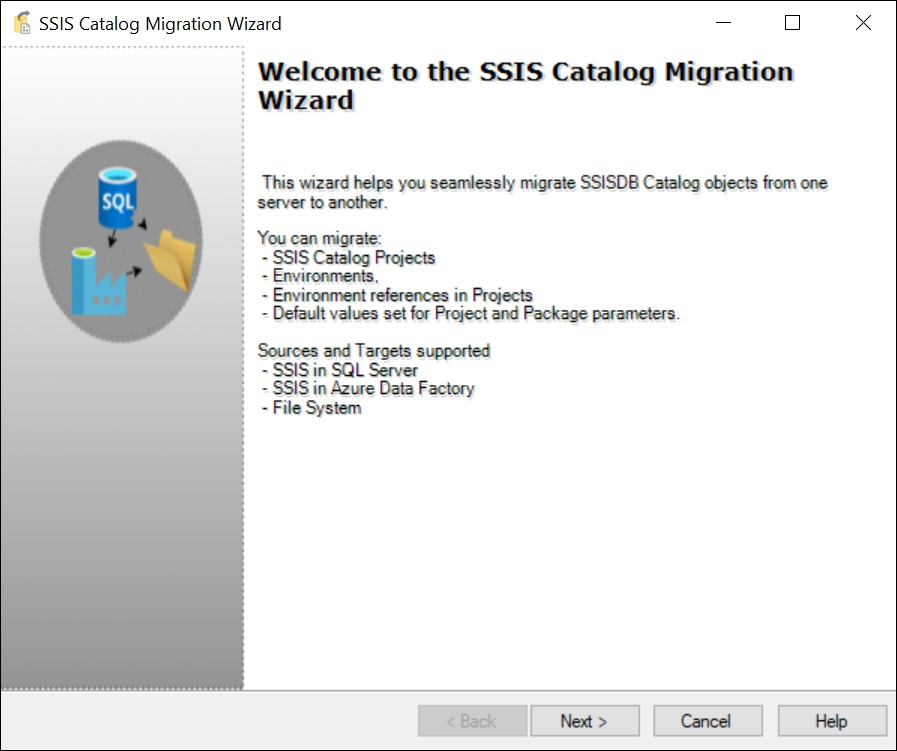
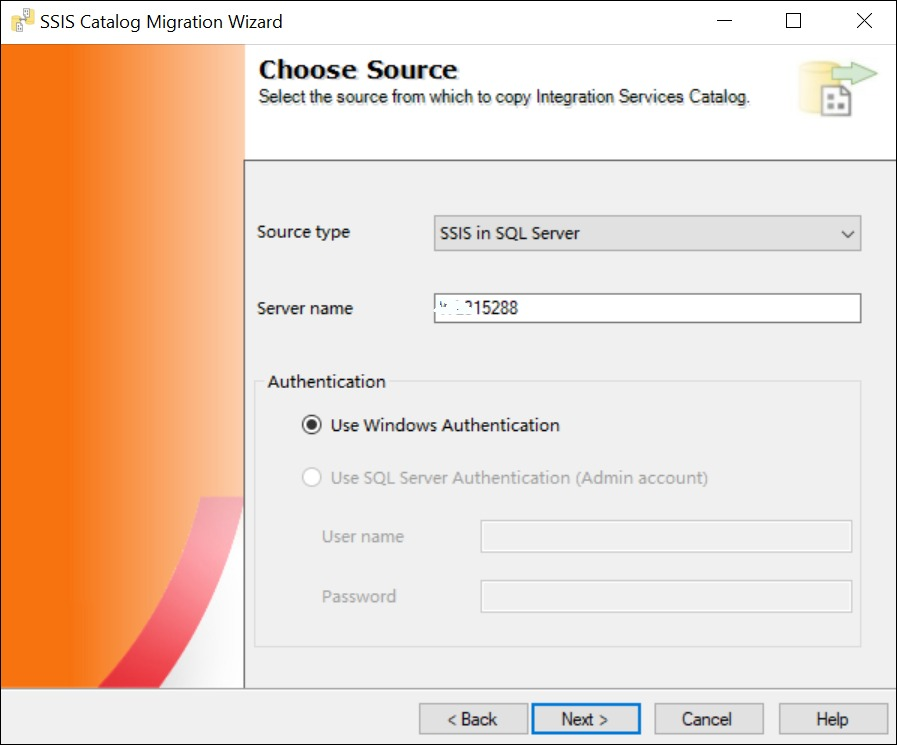
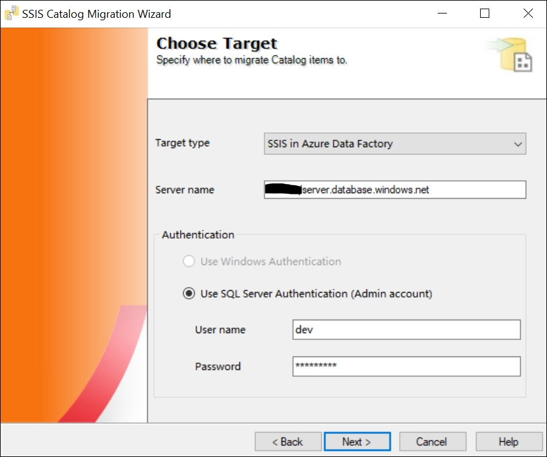
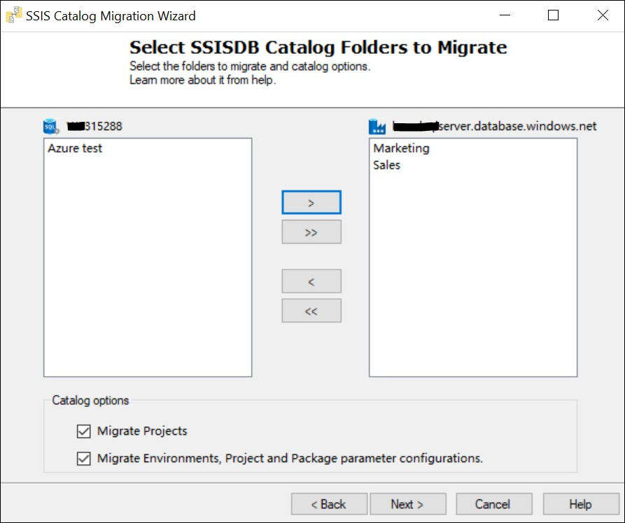
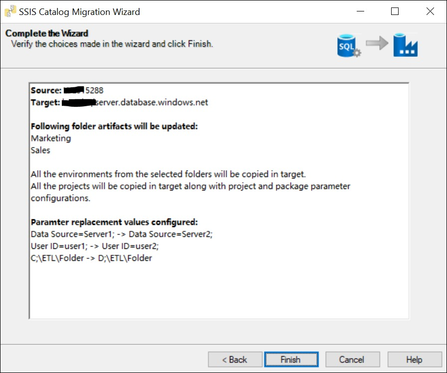
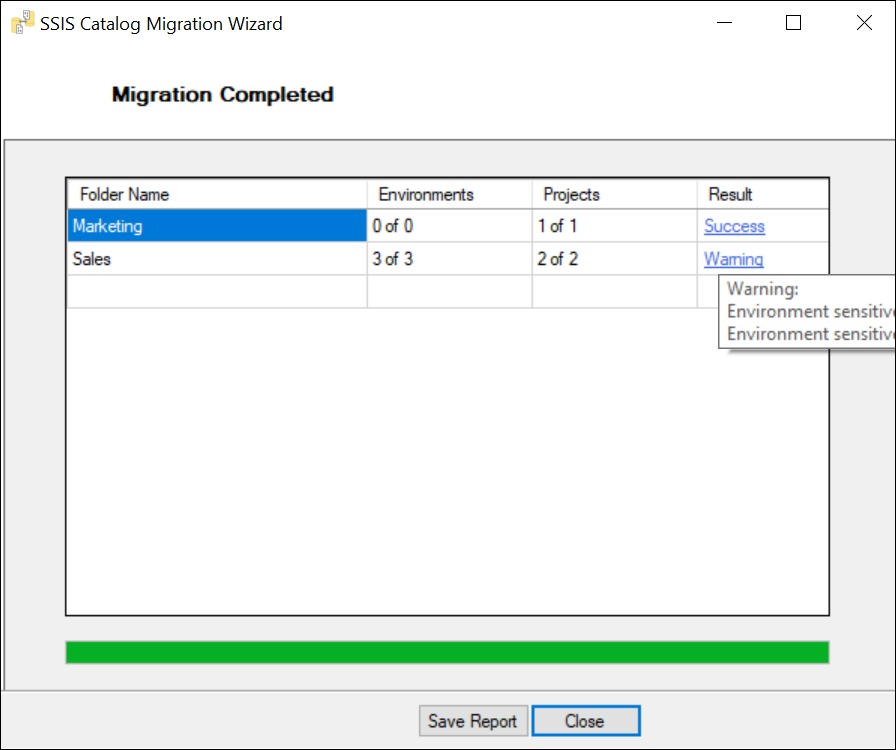

Migrate SSIS catalog to new server quickly using SSIS Catalog Migration Wizard. 

Do you want to:
* migrate ssis to azure data factory
* migrate ssisdb from one server to another
* migrate ssis catalog from 2012 to 2016 (or any version of SQL Server) etc.

Then you are at right place!

# Background

From SQL Server 2012 onwards, Microsoft introduced a new deployment model in SSIS, called the project deployment model. This new model has many benefits in terms of managing SSIS project deployments, executions, and configurations. With every new version of SQL Server, the SSIS Catalog is also getting upgraded with new features. In this article, I will describe how we can migrate the SSIS Catalog from one SQL Server instance to another using the SSIS Catalog Migration Wizard.

The SSIS Integration Services Catalog consists of the following artifacts:

* SSIS Builds (.ispac files) - Contains several SSIS packages with project and package parameters.
* Environments - Stores configurations of SSIS projects. These variables are used to configure the SSIS project and package parameters of SSIS projects.



This quick utility will help you migrate the SSIS catalog in a just few clicks.
# SSIS Catalog Migration Wizard

This quick wizard once installed, can be launched from SQL Server Management Studio (SSMS) 2018 or SQL Server Data Tools (SSDT) 2017 for Visual Studio 2017. Alternatively, you can use it as a standalone tool if you don’t wish you add it as a plugin.

The wizard supports the following source and target types.

* SSIS for SQL Server - SSIS catalog enabled in SQL Server. 

* SSIS for Azure Data Factory - This is used when you want to run SSIS packages in Azure using Azure data factory pipelines.

* File System - SSIS Catalog exported to the file system. This can be used as a staged migration when you don’t have access to source and target SQL Server connections at the same time.

# Demo - Let's Migrate On-premise SSIS to Azure SSIS! 

We’ll see a quick demo on how SSIS Catalog Migration Wizard migrates on-premises SSIS Catalog in SQL Server to SSIS in Azure Data Factory in just a few clicks. Launch the wizard from your preferred location.

**Choose Source** 

Choose SSIS in SQL Server from Source Type drop-down. Provide the SQL Server instance name. To perform operations on the SSIS catalog, we have to use windows authentication. And the user should have the ssis_admin role.

**Choose Target**

Choose SSIS in Azure Data Factory from the Target Type drop-down. Provide Azure SQL Server hostname, admin SQL server authentication user name, and password.

Note - This utility only supports SQL authentication for Azure SSIS at the moment. 

**Select SSISDB Catalog Folders to Migrate**

Choose the catalog folders from the listview that you want to migrate.

At the bottom, choose the catalog options:

* Migrate projects - Select the checkbox if you want to migrate SSIS projects (.ispac) files from the selected list of folders.

* Migrate environments, project and package parameter configurations. - Select the checkbox if you want to migrate catalog Environments. This will apply environment references to SSIS projects and environment variable to parameter mapping. It also includes project and package parameters with default values set in the source SSISDB.

* Delete selected folders from the source Catalog. (Preview) - Select the checkbox if you want to delete selected Catalog folders from source server. 

**While you are on your way, would you like to replace your environment variable values?**

If you wish to replace part of the environment variables, project, or package parameter values with new values, configure the replacement rules on this screen.

As shown in the image above, SSIS Catalog Migration Wizard replaces all occurrences of substring *Data Source=server1* with *Data Source=server2*, *User ID=user1* with *User ID=user2*, and *C:\ETL\Folder* with *D:\ETL\Folder* in all the environment variables and project and package parameter values.

This is useful when you are setting up a parallel environment for your ETL workload and some configuration is different in the target environment. However, this is an optional step. If you don't want to replace anything, you can skip this step and click Next.

**Complete the Wizard**

Review the deployment summary. And if everything looks ok, click Finish.

**Monitor the migration**

Any warning or error during the migration gets available against the respective folder in the Result column tooltip of the grid as shown in the above image.

Note - Sensitive environment variables, project, or package parameter values are encrypted in SSISDB with the master key. Hence, the wizard will not migrate such values. However, it will list such variable names in the Result column tooltip with column value as "Warning". You can also save migration reports in txt format by clicking on Report button.

I hope this extension is helpful to you.  

