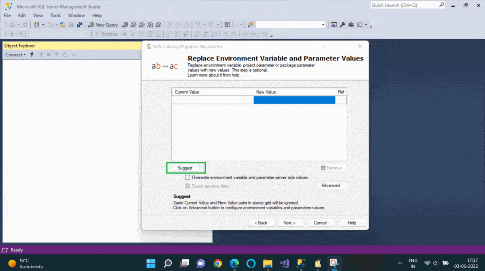

Migrate SSIS catalog to new server quickly using SSIS Catalog Migration Wizard. 

Do you want to:
* migrate ssis to azure data factory
* migrate ssisdb from one server to another
* migrate ssis catalog from 2012 to 2016 (or any version of SQL Server).
* migrate ssis catalog environment variables from DEV to UAT etc.
* you want to automate routine SSIS catalog migrations.

Then you are at right place!



# Background

From SQL Server 2012 onwards, Microsoft introduced a new deployment model in SSIS, called the project deployment model. This new model has many benefits in terms of managing SSIS project deployments, executions, and configurations. With every new version of SQL Server, the SSIS Catalog is also getting upgraded with new features. In this article, I will describe how we can migrate the SSIS Catalog from one SQL Server instance to another using the SSIS Catalog Migration Wizard.

The SSIS Integration Services Catalog consists of the following artifacts:

* SSIS Builds (.ispac files) - Contains several SSIS packages with project and package parameters.
* Environments - Stores configurations of SSIS projects. These variables are used to configure the SSIS project and package parameters of SSIS projects.

This quick utility will help you migrate the SSIS catalog in a just few clicks.
# SSIS Catalog Migration Wizard

This quick wizard once installed, can be launched from SQL Server Management Studio (SSMS) 2018, Visual Studio 2017 and Visual Studio 2019. Alternatively, you can use it as a standalone tool if you don’t wish you add it as a plugin.

[!](http://azureops.org/product/ssis-catalog-migration-wizard-pro/)

The wizard supports the following source and target types.

* SSIS for SQL Server - SSIS catalog enabled in SQL Server. 

* SSIS for Azure Data Factory - This is used when you want to run SSIS packages in Azure using Azure data factory pipelines.

* SCMW export - This is a special export format for SSIS Catalog items.

# Demo - Let's Migrate On-premise SSIS to Azure SSIS! 

We’ll see a quick demo on how SSIS Catalog Migration Wizard migrates on-premises SSIS Catalog in SQL Server to SSIS in Azure Data Factory in just a few clicks.

**Choose Source** 

Choose SQL Server radio button. Provide the SQL Server instance name. To perform operations on the SSIS catalog, we have to use windows authentication. And the user should have the ssis_admin role.

**Choose Target**

Choose the Azure data factory radio button. Provide Azure SQL Server hostname, admin SQL server authentication user name, and password.

Note - This utility only supports SQL authentication for Azure SQL Server connection.

**Select SSISDB Catalog Items to Migrate**

Choose the catalog items from the treeview.

***Compare source & target***

Compare source and target and choose to migrate only what has changed.
For example, in the above image:
* Green items are present in the source and not present in the target,
* Red items mean source and target items are not the same.
* Unmodified items are displayed in the original color and these objects are identical in the source and target

***Migration Type***

Migration types are ‘copy’ and ‘move’. Select the’ move’ radio button if you wish to delete the source catalog after the migration is done. Default is ‘copy’.

***Migrate explicit permissions***

Catalog folders, projects, and environments have explicit permissions. If you want to migrate it to target, check the checkbox ‘Migrate explicit permissions' on this screen.

**Customize folder mapping**

Easily map source and target folders names. Wizard populates all selected folder names in Source and Target folder columns. Edit the value in the ‘Target Folder’ column if you wish to customize the folders.

For instance, as shown in the above image, the wizard will copy the content of the source catalog folder Pqr to the target catalog folder Abc. This step is optional.

**While you are on your way, would you like to replace your environment variable values?**

Configure the key-value pairs that you would like to replace in the environment variable and parameter values. Suggest button populates all the data sources in the source catalog environment variables that you might like to replace in the target.

Perhaps, this is useful when you are setting up a parallel environment for your ETL workload and some configuration is different in the target environment. This configuration is optional.

***Overwrite environment variable values***

‘Overwrite environment variable values’ setting recreates environment variables & parameter default values in the target. Note here that you may lose target data in this case.

***Export sensitive data***

This setting is applicable when you are exporting SSIS Catalog to the SCMW file.SCMW export file is not encrypted. ‘Export sensitive data’ setting exports sensitive information in the export file as free text.

**Complete the Wizard**

***Automation (Command-line utility)***

With the command-line utility, we can now automate routine migrations in a matter of few clicks. The migration script can run using any scheduler like SQL Server Agent job. Here, the script button at this step will generate a command-line script based on the choice made in previous steps.

For example, in the current case, the command-line script will look like below.

    SSIS.Cataloger.Pro.exe /st:0 /ssn:SQLServerInstance /tt:1 /tsn:azuresql.database.windows.net /items:”[{"FolderName":"Azure test","Projects":[],"Environments":["env1"]},{"FolderName":"AzureDevOpsDeployment","Projects":["testUC"],"Environments":[]},{"FolderName":"Sales","Projects":["sales-stg2"],"Environments":[]}]” /fm:”{"Azure Test":"Azure Prod"}” /fm:”{"Pqr":"Abc"}” /oev:true

More information about the command-line utility parameters and usage examples is available here.Review the deployment summary. And if everything looks ok, click Finish.

**Monitor the migration**

Any warning or error during the migration gets available against the respective folder in the Result column tooltip of the grid as shown in the above image.SSIS Catalog Migration wizard can do a lot more things. In my next article, I will describe how to automate routine SSIS migrations using this tool.
