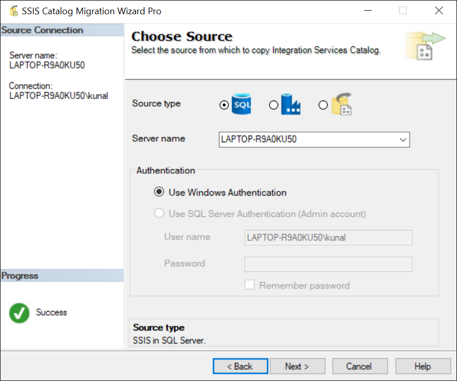
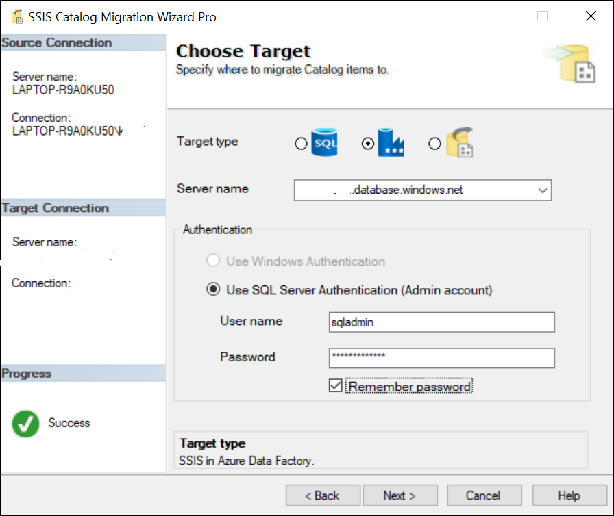

# SSISCataloger, the SSIS Catalog Migration Wizard

From SQL Server 2012, Microsoft has introduced a new deployment model in SSIS called the project deployment model. This new model has great benefits in terms of managing SSIS project deployments, executions, and configurations. With every new version of SQL Server, SSIS Catalog is also getting upgraded with new features. In this article, I will describe how we can migrate our existing SSIS Integration Services Catalog from one SQL server to another.  

SSIS Integration services catalog consists of the following artifacts:
SSIS Builds (.ispac files): Contains several SSIS packages with project and package parameters.
Environments (Typically used to store configurations of your SSIS projects). These variables are used to configure the SSIS project and package parameters of SSIS projects.

**The need for this activity might arise when:**
* you are migrating your SQL server to a new server. 
* upgrading the SQL server to a newer version on a different machine.
* setting up a new SSIS environment from the existing setup, etc.

This quick utility will help you migrate your existing SSIS catalog in a few clicks. 

# How to install

Download and follow the instructions from  [visualstudio marketplace](https://marketplace.visualstudio.com/items?itemName=KunalRathi.ssiscatalogmigrator). 

Alternatively, if you have Visual Studio Data Tools 2017, you can download it from **Extensions and Updates** under **Tools** menu item.

# About the wizard

This quick wizard once installed, can be launched from SQL Server Management Studio (SSMS) 2018 or SQL Server Data Tools (SSDT) 2017 for Visual Studio 2017. Alternatively, you can use it as a standalone tool if you don't wish you add it as a plugin. 

## Sources & Targets

It supports the following source and target types. 

**SSIS for SQL Server** - SSIS catalog enabled in SQL Server. 

**SSIS for Azure Data Factory** - This is used when you want to run SSIS packages in Azure using Azure data factory pipelines. 

**File System** - SSIS Catalog exported to the file system. This can be used as a staged migration when you don't have acess to source and target SQL server connection at the same time.

# Demo

We'll see a quick demo on how to migrate SSIS Catalog from on-premise SQL Server to SSIS in Azure Data Factory in just a few clicks.

### Choose Source 
Choose SSIS in SQL Server from Source Type drop-down.

Provide SQL Server instance name. 
To perform operations on SSIS catalog, we have to use windows authentication. And user should have ssis_admin role.  

### Choose Target
Choose SSIS in Azure Data Factory from the Target Type drop-down. 

Provide Azure SQL Server hostname, admin SQL server authentication user name, and password.

**Note**: This utility only supports SQL authentication for Azure SSIS at the moment. 

### Select SSISDB Catalog Folders to Migrate

Choose the catalog folders from the listview you want to migrate. 

Select Catalog options:

**Migrate Projects** - Select the checkbox if you want to migrate SSIS projects (.ispac) files from the selected list of folders.

**Migrate Environments, Project and Package parameter configurations** - Select the checkbox if you want to migrate catalog Environments. This will also apply environment references to SSIS projects and parameter mapping. If there are server side default values set for some project or package parameters, those will also be migrated to target server.

### Replace Environment variable and Parameter values

If you wish to replace environemnt variable, project or package parameter values with new values, configure the replacement rules in this screen.

As shown in the image above, all the environment variable and project and package parameter values with substring Data Source=server1 will be replaced with Data Source=server2, User ID=user1 with User ID=user2 and C:\ETL\Folder with D:\ETL\Folder.
This is useful when you are setting up a parallel environment for your ETL workload and some configuration is different in target environment.

This is an optional step. If you dont want to replace anything, you can skip this step by clicking Next.

 
### Complete the Wizard

Review the deployment summary. And if everything looks ok, click Finish.

### Monitor the migration

Monitor the migration.

If there is any warning or error during the migration, it will be shown against the respective folder in the Result column of the grid.
**Note**: Sensitive environment variables, project or package parameter values are encrypted in SSISDB with master key. Hence, such values cannot be copied in this migration. However, such variable/parameter names will be listed in Result column tooltip and the status value will be shown as a warning. 
You can also save migration reports in CSV format by clicking on Save Report.

